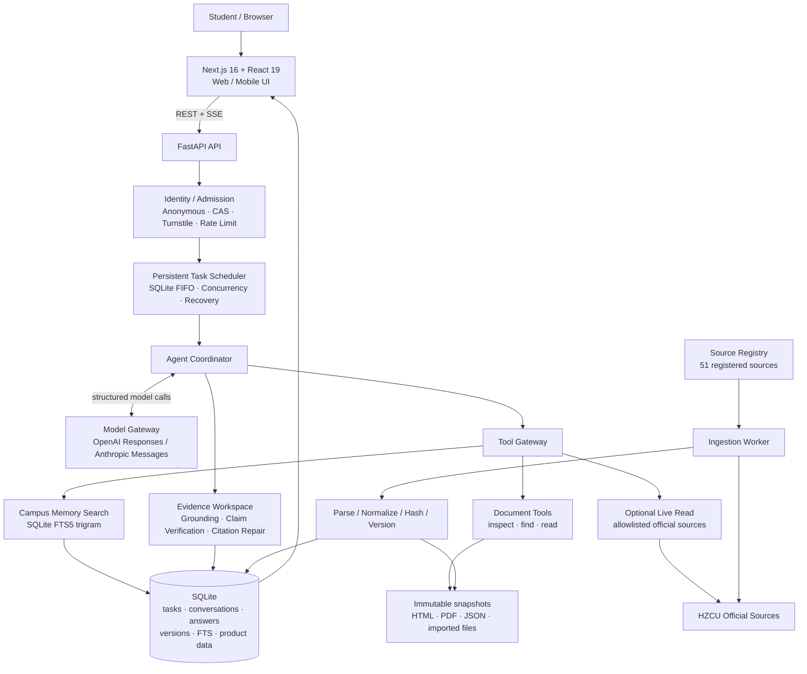
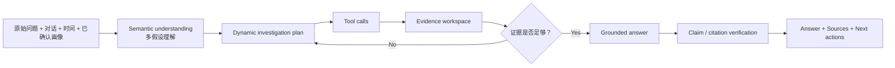
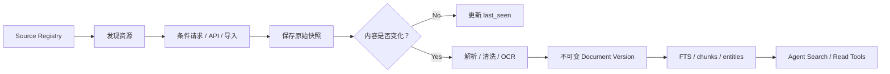

# HZCU Campus Agent

面向浙大城市学院学生的 **Model-native Campus Agent**。  
项目不是传统 FAQ / 关键词问答，也不是“知识库 + 大模型”的简单套壳，而是让模型保留用户原始问题与上下文，自主规划调查步骤，通过受控工具读取校园资料，在证据充分后生成可追溯回答。

**Next.js 16 · React 19 · TypeScript · FastAPI · Python 3.12 · SQLite FTS5 · SSE · OpenAI Responses / Anthropic Messages · Docker**

> **实际使用**：项目已被学院采用并用于新生服务，近期日均约 **200 次调用**。  
> **开发方式**：个人独立完成产品设计、Agent 架构、前后端、校园数据管线、部署与测试。

---

## Demo

### 产品界面

项目提供简洁模式与角色化「琮羽」模式，两套界面共享同一套会话、Agent、证据链和用户数据逻辑。

<table>
  <tr>
    <td width="50%" align="center">
      
      <br />
      <sub>Minimal / 简洁模式</sub>
    </td>
    <td width="50%" align="center">
      
      <br />
      <sub>Congyu / 琮羽模式</sub>
    </td>
  </tr>
</table>

### 一次完整 Demo 会发生什么

例如用户直接问：

> **“国创大概什么时候会中期检查，校创需要吗？”**

HZCU Agent 不把问题先压成一个固定意图标签，而是执行完整调查链路：

1. 保留原始问题、近期对话、当前时间和用户已确认画像；
2. 形成可修正的理解假设，并动态生成调查计划；
3. 从校园镜像中搜索候选材料，必要时继续查看文档结构、文内查找并读取完整段落；
4. 在权限与网络允许时，对登记过的官方来源进行实时只读核验；
5. 将取得的材料转换为带来源、时间和适用范围的 Evidence；
6. 对关键校园事实做 grounding / citation verification；
7. 通过 SSE 将“理解 → 规划 → 调查 → 成稿”的真实进度持续推送到前端；
8. 最终返回带引用的回答，并保留任务、回答、证据与会话记录。

前端内置的典型 Demo 问题包括：

- “这个学年暑假后什么时候开学？”
- “国创大概什么时候会中期检查，校创需要吗？”
- “选课时怎样兼顾绩点、兴趣和后续发展？”

默认 Demo 模式无需模型 API Key，也会真实运行会话、检索、证据链、任务状态与界面流程；配置真实模型后，才启用多假设理解、动态规划、调查与回答组合。

---

## Architecture

### 系统架构



### Agent 执行链路



这里的核心设计是：**模型负责理解、规划和材料取舍；代码负责工具、权限、预算、证据与安全边界。**  
正常路径不会把校园问题硬编码成“问题分类 → 固定来源 → 模板答案”。

---

## Engineering Highlights

| 方向 | 实现 |
| --- | --- |
| **Agent Runtime** | Coordinator + Model Gateway；保留原问题与上下文，支持多假设理解、动态调查计划、工具调用、证据复核和回答修订 |
| **Grounding** | 任务内 Evidence ID、claim-level citation、独立 verification、引用修复；无足够材料时明确暴露证据缺口 |
| **校园检索** | SQLite FTS5 trigram + BM25 / 标题权重 / 服务端权限过滤；搜索负责发现候选，模型继续 inspect / find / read 原文 |
| **持续数据更新** | Source Registry 当前登记 **51 个官方/校园来源**；Worker 支持条件请求、内容哈希、不可变版本和原始快照 |
| **多格式解析** | HTML、GB2312 旧站、PDF、JSON API、导入材料；保留文档版本、原文定位、时间与适用范围 |
| **任务基础设施** | SQLite 持久化 FIFO 调度、单主体/全局并发限制、任务取消、排队超时、服务重启恢复 |
| **实时体验** | SSE 推送理解、规划、工具读取、证据获取和回答阶段；断线后可通过持久化任务恢复 |
| **身份与安全** | 匿名设备主体、可选 CAS、Turnstile、CSRF、来源 allowlist、凭据隔离、只读校园工具 |
| **知识闭环** | 证据不足时可进入社区问题；贡献者回答经审核后可沉淀为 curated knowledge，并保持官方来源优先 |
| **工程验证** | Pytest、Playwright、TypeScript typecheck、Next.js production build、Alembic migration |

---

## Why not a normal RAG chatbot?

普通校园问答很容易变成：

```text
用户问题
  → 意图分类
  → 向量库 Top-K
  → 拼 Prompt
  → 生成答案
```

这对“今年 / 我这个年级 / 这个学院 / 现在是否仍有效 / 两份通知冲突”之类问题并不可靠。

HZCU Agent 更接近一个受约束的调查型 Agent：

```text
理解真实问题
  → 建立可修正假设
  → 规划调查路径
  → 搜索候选材料
  → 阅读原文
  → 判断时效与适用范围
  → 必要时继续调查
  → 对事实声明逐项绑定证据
  → 输出可追溯答案
```

校园知识库在这里是 **长期记忆与现实缓存**，而不是 Agent 的“大脑”。

---

## Data & Evidence Pipeline



当前数据链路重点保证：

- 来源必须先进入白名单 Source Registry；
- 原始 HTML / PDF / JSON / 导入文件保留快照；
- 同一 URL 内容变化会生成新版本，而不是覆盖历史；
- 检索结果携带来源、观察时间、版本与可见范围；
- 历史材料不会自动冒充当前规则；
- 实时访问失败时，本地已验证镜像仍可作为明确标注的缓存证据。

---

## Product Features

### 学生端

- 多轮校园问答；
- Agent 实时调查进度；
- 回答证据与官方来源展开；
- 历史会话恢复；
- 已确认画像与个性化上下文；
- 手动待办；
- 回答反馈；
- 简洁 / 琮羽双主题；
- 移动端适配；
- 问题广场与知识详情页。

### 管理端

- 来源状态、版本与新鲜度观察；
- Agent 任务健康与运行指标；
- 模型 / API 配置；
- 匿名试用与队列策略；
- 社区问题审核；
- 贡献者管理；
- Curated Knowledge 草稿、发布、移动与退役；
- 审计记录与官方来源优先规则。

---

## Tech Stack

| Layer | Stack |
| --- | --- |
| Web | Next.js 16, React 19, TypeScript, React Markdown, Lucide |
| API | Python 3.12, FastAPI, Pydantic, SQLAlchemy Async, Alembic |
| Agent | Coordinator, Model Gateway, Tool Gateway, Grounding / Verification |
| Model Providers | OpenAI Responses API, Anthropic Messages API, no-key Demo adapter |
| Retrieval | SQLite FTS5 trigram, BM25, structured document reading |
| Data | SQLite, immutable document versions, filesystem snapshots |
| Realtime | Server-Sent Events (SSE) |
| Auth / Safety | Anonymous device identity, optional CAS, Turnstile, CSRF, allowlist |
| Deployment | Docker Compose, Caddy, standalone Windows / Linux |
| Test | Pytest, Playwright, TypeScript, Next.js production build |

---

## Repository Structure

```text
HZCU_Agent/
├─ apps/
│  ├─ api/
│  │  ├─ src/hzcu_agent/
│  │  │  ├─ api/            # FastAPI routes
│  │  │  ├─ services/       # Coordinator / scheduler / model / grounding
│  │  │  ├─ tools/          # Campus search / document / live tools
│  │  │  ├─ ingestion/      # Crawl / parse / snapshot / index
│  │  │  └─ resources/      # Source Registry
│  │  ├─ alembic/           # Database migrations
│  │  └─ tests/
│  └─ web/
│     ├─ app/                # Next.js App Router
│     ├─ components/         # Agent / evidence / admin / community UI
│     ├─ public/             # Theme assets
│     └─ e2e/                # Playwright tests
├─ docs/                     # PRD / system / agent / ingestion / ADR
├─ deploy/                   # Caddy
├─ scripts/                  # Windows / Linux helpers
├─ docker-compose.yml
└─ Makefile
```

---

## Quick Start

### Windows

不需要 WSL。PowerShell 脚本会创建独立虚拟环境、安装依赖、执行迁移并启动 API + Web：

```powershell
powershell -ExecutionPolicy Bypass -File .\scripts\start-windows.ps1
```

默认启动 **no-key Demo mode**。终端会输出本机和局域网访问地址，手机与电脑在同一局域网即可直接访问。

### Linux / macOS / WSL

要求：

- Python 3.12+
- uv
- Node.js 24+
- npm

启动 API：

```bash
make api-install
make api-migrate
make api-dev
```

启动 Web：

```bash
make web-install
make web-dev
```

默认访问：

- Web: http://localhost:3000
- API health: http://localhost:8000/api/v1/health

首次同步可使用：

```bash
.venv/bin/hzcu-agent list-sources
.venv/bin/hzcu-agent sync-sources --limit 3
.venv/bin/hzcu-agent search-memory "创新训练项目" --top-k 8
```

真实模型、本地管理员、CAS 与正式部署配置见 [本地试用与运行手册](docs/21-pilot-demo-runbook.md)。

---

## Verification

```bash
make api-test
make web-build
```

前端还提供：

```bash
cd apps/web
npm run typecheck
npm run e2e
```

---

## Scope & Security

当前公开版本聚焦 **校园公开/已批准镜像信息的只读调查**。

明确不做：

- 查询个人成绩、学分等敏感教务数据；
- 代替学生执行选课、申请、提交等业务写操作；
- 让模型直接访问任意 URL、数据库、文件或账号凭据；
- 在 Source Registry、仓库或快照中保存 CAS / VPN 密码、Cookie、Token、API Key。

公开仓库不包含校外 VPN sidecar、真实登录抓取脚本或私有凭据。

---

## Documentation

想快速理解代码，建议按这个顺序：

1. [当前系统结构](docs/02-system-spec.md)
2. [Agent 行为与工具使用](docs/03-agent-spec.md)
3. [数据采集与版本链路](docs/05-data-ingestion-spec.md)
4. [工具与应用 API](docs/06-tool-api-spec.md)
5. [当前实现状态](docs/13-implementation-status.md)
6. [本地试用与运行手册](docs/21-pilot-demo-runbook.md)
7. [Architecture Decision Records](docs/adr/README.md)

完整文档索引见 [docs/00-index.md](docs/00-index.md)。

---

## License

See [LICENSE](LICENSE).
