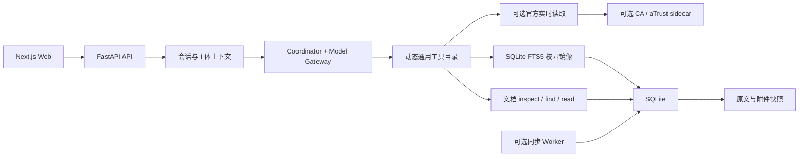

# 当前系统结构

| 属性 | 值 |
|---|---|
| 文档编号 | SPEC-SYS-001 |
| 状态 | Current Architecture Reference |
| 关联 PRD | [01-prd.md](01-prd.md) |

## 1. 范围

本文只解释当前代码如何运行，不规划未来平台。多实例、分布式队列、PostgreSQL、
向量数据库、额外安全平台和容量工程都不属于当前阶段，除非用户针对实际部署另行
提出。

## 2. 当前架构



核心运行链路只有 Web、API、模型、工具、SQLite 和快照。同步 Worker、CA、实时
Campus 路由、VPN sidecar、只读运营台和 Docker 拓扑是已经存在的可选组件；缺少
这些组件时，匿名本地镜像问答仍可运行。

## 3. 组件职责

### 3.1 Web

- 创建和恢复会话；
- 发送问题并通过 SSE 展示任务进度；
- 展示回答、证据、来源、历史会话、画像、手动待办和反馈；
- 根据服务端能力显示或隐藏可选登录和运营入口。

### 3.2 API

- 管理匿名设备主体和可选 CA 主体；
- 持久化会话、任务、回答及产品数据；
- 构建模型上下文并协调工具调用；
- 提供来源账本、健康状态和只读运营接口；
- 在进程重启后把未完成任务恢复为明确状态。

### 3.3 Model Gateway 与 Coordinator

- 把用户原始问题、必要对话、已确认画像、当前时间和动态工具目录交给模型；
- 让模型生成调查步骤、选择材料、决定是否继续翻阅并组合回答；
- 执行工具参数、权限、预算和证据 ID 等通用契约；
- 不用业务标签、正则或固定来源列表替模型判断问题类别和材料价值。

### 3.4 校园镜像与文档读取

- Source Registry 定义用户已批准的官方来源范围；
- SQLite 保存资源、不可变版本、当前版本、FTS5 索引、产品数据和任务数据；
- 快照目录保存网页、附件和导入原件；
- 搜索只负责发现候选，模型可以继续检查结构、文内查找和按 locator/offset 阅读。

### 3.5 实时读取与同步

- 公开实时读取只访问已登记官方来源；
- Campus 实时读取只在登录和路由实际可用时出现在工具目录；
- 匿名试用可读取已批准的 Campus 本地镜像，但不会因此获得 Campus 实时能力；
- 同步 Worker 可独立运行，更新资源、版本、快照和派生索引。

## 4. 当前数据平面

- 主数据库：单节点 SQLite。
- 主检索：SQLite FTS5 trigram，按当前版本、来源、时间、质量和可见范围过滤。
- 原文：本地快照目录中的内容寻址文件。
- 派生数据：FTS、分块、向量和实体可重建；当前主检索不依赖向量或 ANN。
- 产品数据：会话、任务、回答、画像、待办和反馈保存在同一持久化数据库。

## 5. 当前部署方式

优先支持直接启动：

```text
Next.js Web + FastAPI API + SQLite 文件 + snapshots 目录
```

目标环境已有 Docker Compose 时，也可使用现有 Web、API、Worker、Caddy 和持久化
数据卷拓扑。Docker、TLS、CA 或 sidecar 都不是直接部署的前置条件。

实际命令见 [`21-pilot-demo-runbook.md`](21-pilot-demo-runbook.md)。

## 6. 错误与恢复

| 情况 | 当前处理 |
|---|---|
| 模型不可用 | 返回明确可恢复错误，不冒充真实模型回答 |
| 单个工具失败 | 将错误交回 Agent，允许调整调查或透明说明 |
| 实时来源不可用 | 保留本地镜像证据，不把失败解释为“没有信息” |
| 文档解析失败 | 保留原件，未形成可靠正文时不作为事实证据 |
| FTS 派生索引损坏 | 从文档版本重建 |
| SSE 断开 | 通过任务和回答接口恢复状态 |
| API 重启 | 已持久化结果继续可读，未完成任务进入明确恢复状态 |

## 7. 范围规则

- 新组件、新部署平台或新数据能力必须由用户提出。
- 实际故障按现有功能修复，不自动变成新平台或新 PRD。
- 本文与代码不一致时先按实际代码修正文档，不把差异解释为待开发功能。
