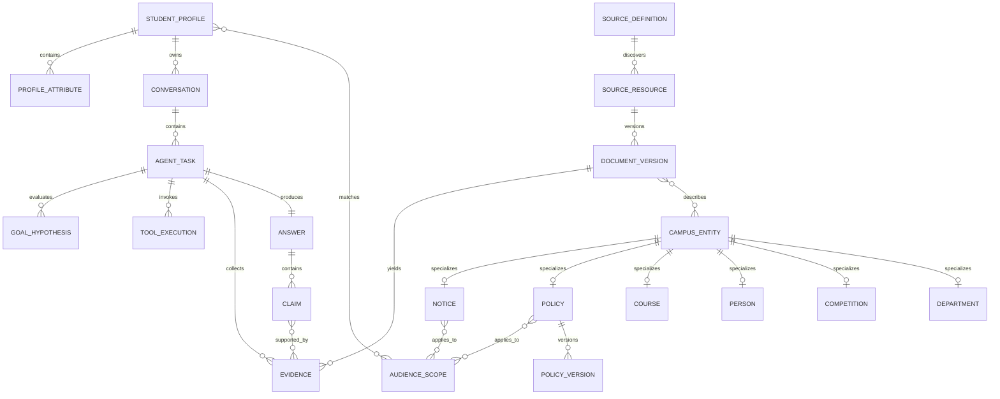

# 领域模型

| 属性 | 值 |
|---|---|
| 文档编号 | SPEC-DOMAIN-001 |
| 状态 | Domain Reference |

本文统一既有实现中的概念，不表示所有列出的概念都需要在当前阶段开发。新增实体、
流程或能力必须先由用户确认。

## 1. 目的

领域模型用于统一产品、Agent、数据、API 和测试中的概念，防止将“网页、文档块、用户问题”误当成完整业务模型。

## 2. 限界上下文

### 2.1 Student Context

学生身份、画像、目标、偏好、权限和待办。

### 2.2 Campus Information Context

来源、资源、文档版本、通知、政策、课程、人员、竞赛、部门和校园时间。

### 2.3 Agent Task Context

对话、任务、目标假设、调查计划、工具执行、证据、主张和回答。

### 2.4 Ingestion Context

来源登记、同步游标、抓取、解析、版本比较、质量检查和索引。

### 2.5 Governance Context

数据分类、授权、反馈、纠错和由用户确认的范围决策。

## 3. 核心关系



## 4. 聚合与实体

### 4.1 StudentProfile

学生画像聚合根。

字段：

- `student_profile_id`
- `subject_id`：匿名会话或登录主体。
- `student_type`：本科生、研究生等。
- `cohort`
- `college`
- `major`
- `goals`
- `interests`
- `preferences`
- `created_at`
- `updated_at`

约束：

- 每个属性必须标记 `confirmed` 或 `inferred`。
- 推断属性必须保存置信度和来源对话。
- 用户确认值优先于推断值。
- 删除画像必须级联删除非必要个性化记忆。

### 4.2 ProfileAttribute

值对象：

```text
name
value
status: confirmed | inferred | rejected
confidence
source_turn_id
confirmed_at
expires_at
```

### 4.3 Conversation

连续交互容器，包含消息、摘要和相关任务。

Conversation 不是长期画像；会话中的临时情绪和临时偏好默认不进入 StudentProfile。

### 4.4 AgentTask

一次需要解决的用户目标，可以跨多轮对话。

字段：

- `task_id`
- `conversation_id`
- `original_request`
- `status`
- `risk_level`
- `created_at`
- `resolved_at`

`status` 仅表示工程生命周期，例如 `active`、`waiting_user`、`resolved`、`failed`；不作为语义路由状态机。

### 4.5 GoalHypothesis

Agent 对真实目标的可修正假设：

- `description`
- `confidence`
- `supporting_context`
- `required_evidence`
- `status`：active、supported、rejected。

同一任务可以同时保留多个假设。

### 4.6 SourceDefinition

受治理的数据源定义：

- `source_id`
- `name`
- `owner_department`
- `base_url`
- `allowed_hosts`
- `visibility`
- `authority_level`
- `acquisition_method`
- `freshness_policy`
- `rate_limit`
- `parser_profile`
- `enabled`

### 4.7 SourceResource

一个可寻址的网页、API 对象或附件：

- `resource_id`
- `source_id`
- `canonical_uri`
- `external_id`
- `resource_type`
- `first_seen_at`
- `last_seen_at`
- `current_version_id`

### 4.8 DocumentVersion

不可变内容版本：

- `document_version_id`
- `resource_id`
- `content_hash`
- `raw_snapshot_uri`
- `normalized_text`
- `published_at`
- `effective_from`
- `effective_to`
- `observed_at`
- `parser_version`
- `quality_status`

禁止原地覆盖历史版本。

### 4.9 CampusEntity

从来源中提取的校园实体基类：

- `entity_id`
- `entity_type`
- `canonical_name`
- `aliases`
- `source_versions`
- `valid_from`
- `valid_to`

### 4.10 Notice

通知：

- 标题、发布部门。
- 发布时间、开始时间、截止时间。
- 适用对象。
- 办理动作、地点、联系人、附件。
- 当前状态：upcoming、open、closed、cancelled、unknown。

通知状态应由时间与官方更新计算，不仅依赖模型文本判断。

### 4.11 Policy / PolicyVersion

政策及版本：

- 文件号、名称、责任部门。
- 生效和失效时间。
- 适用学生范围。
- 替代或废止关系。
- 条款结构。

同一政策的历史版本必须可并存。

### 4.12 Course

- 课程代码和名称。
- 学分、课程性质。
- 开课单位。
- 先修与互斥关系。
- 面向年级和专业。
- 对培养方案的归属。

公开版本不保存个人选课结果。

### 4.13 Person

教师或导师公开资料：

- 姓名、单位、职称。
- 公开研究方向。
- 公开联系方式。
- 个人主页。
- 可核验的指导或招生信息。

Agent 不应从公开资料推断敏感个人属性。

### 4.14 Competition

- 名称、级别、主办方。
- 面向对象。
- 报名窗口。
- 相关能力和领域。
- 校内承办单位与指导资源。

### 4.15 Evidence

一次 Agent 任务中的证据对象：

- `evidence_id`
- `document_version_id` 或 `tool_execution_id`
- `excerpt`
- `locator`
- `observed_at`
- `fresh_until`
- `audience_scope`
- `authority_level`
- `supports`
- `contradicts`

Evidence 是任务级引用，不等同于永久文档块。

### 4.16 Claim

回答中的可核验主张。

每个校园事实 Claim 必须关联至少一条有效 Evidence。一般建议可以没有校园来源，但必须标记为分析或建议。

### 4.17 ToolExecution

- 工具名和版本。
- 输入参数的脱敏表示。
- 权限范围。
- 开始、结束时间。
- 状态、错误类别。
- 返回证据引用。
- 成本与追踪 ID。

### 4.18 Answer

- 最终用户可见内容。
- 采用的关键假设。
- 实时核验状态。
- Claims 与 Citations。
- 建议动作。
- 生成模型和提示版本。
- 用户反馈。

## 5. 值对象

### 5.1 AudienceScope

```text
student_type
cohorts
colleges
majors
campuses
other_conditions
```

空字段表示未限定，而不是未知。未知必须显式表示。

### 5.2 FreshnessPolicy

```text
default_ttl
live_required_for
poll_interval
stale_behavior
```

### 5.3 Provenance

```text
source_id
resource_id
document_version_id
canonical_uri
publisher
published_at
observed_at
content_hash
```

## 6. 来源权威模型

建议权威层级：

1. 经授权的当前校内业务系统数据。
2. 责任部门发布的当前正式文件或通知。
3. 学校级官方公开页面和信息公开材料。
4. 学院级官方页面，限本学院适用范围。
5. 官方教师个人主页和官方新媒体内容。
非官方内容可以作为用户需求线索，但不得单独支持政策事实。

## 7. 时间语义

系统至少区分：

- `published_at`：官方发布时刻。
- `updated_at`：官方修改时刻。
- `effective_from/to`：内容生效区间。
- `observed_at`：系统观察时刻。
- `fresh_until`：本次证据可被视为当前的截止时刻。
- `event_start/end`：活动或办理窗口。

“最新”不能仅按抓取顺序判断，应综合官方时间、版本关系与观察时间。

## 8. 领域不变量

1. 历史 DocumentVersion 不可覆盖。
2. 校园事实 Claim 必须映射 Evidence。
3. Evidence 必须映射可追溯 Provenance。
4. 推断画像不得覆盖确认画像。
5. 来源权限在检索前过滤，而不是生成答案后过滤。
6. 个人数据不能写入公开校园记忆。
7. 过期证据不能支持“当前仍然有效”的主张。
8. 一个问题可以同时拥有多个 GoalHypothesis。
