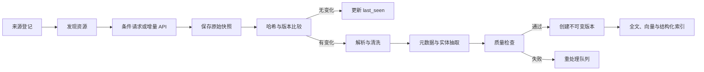

# 数据源、持续采集与实时更新规格

| 属性 | 值 |
|---|---|
| 文档编号 | SPEC-DATA-001 |
| 状态 | Ingestion Reference |
| 核验日期 | 2026-08-03 |

本文解释现有采集和版本链路，不授权自行扩展来源范围、质量项目或验收指标。只有用户
明确指定的新来源或材料才进入当前采集工作。

## 1. 目标

为 Agent 提供可追溯、带时间语义、可持续更新的校园世界信息，同时支持查询时实时调查。

数据系统不是一次性“建知识库”，而是持续维护：

- 当前校园状态。
- 不同年级和时间的历史版本。
- 官方来源之间的关系与冲突。
- 可被 Agent 工具精确查询的结构化实体。

## 2. 来源登记

任何来源在采集或实时调用前必须登记。

实现中的登记文件为
`apps/api/src/hzcu_agent/resources/sources.yaml`。示例：

```yaml
sources:
  - id: hzcu_main
    name: 浙大城市学院官网
    owner_department: 党委宣传部
    base_url: https://www.hzcu.edu.cn/
    allowed_hosts:
      - www.hzcu.edu.cn
    visibility: public
    authority_level: school_official
    acquisition:
      methods:
        - list_poll
        - query_time_fetch
      poll_interval: PT1H
      rate_limit_per_minute: 20
    freshness:
      default_ttl: PT1H
      live_required_for:
        - deadline
        - current_status
    parser_profile: hzcu_webplus
    snapshot_policy: raw
    enabled: true
```

禁止在来源配置中保存密码、Cookie、Token 或私钥。凭据只能使用环境密钥引用。

## 3. 首批来源类别

- 学校主站和公示公告。
- 信息公开目录与学生手册。
- 学生服务页、校历和校园服务。
- 教务处公开通知与附件。
- 各学院官方页面。
- 教师个人主页。
- 招生、就业、竞赛、创新创业等官方栏目。
- 信息化部门确认可公开调用的 API。

具体 URL 与 API 在来源调研阶段登记并由责任人确认。

## 4. 获取方式

优先顺序：

1. Webhook 或发布事件。
2. 官方 API 增量同步。
3. RSS、站点地图或结构化列表。
4. HTML 列表和详情页增量轮询。
5. 查询时实时读取。
6. 周期性完整校验。

只有必要的动态页面才使用浏览器自动化。

## 5. 持续采集流程



## 6. 增量策略

### 6.1 API

优先使用：

- `updated_at` 游标。
- 单调递增 ID。
- 分页和最后成功页。
- ETag 或版本号。

同步必须幂等。同一外部对象和内容哈希不得产生重复版本。

### 6.2 HTML

- 规范化 URL。
- 保存列表项外部 ID、发布时间和详情 URL。
- 使用 `If-None-Match`、`If-Modified-Since`。
- 若服务端不支持条件请求，比较正文与附件哈希。

### 6.3 PDF 与附件

- 保存原文件。
- 提取文本、目录、页码和表格。
- 低文本密度文件进入 OCR 队列。
- 附件替换必须产生新版本，即使 URL 不变。

### 6.4 完整结构发现

完整采集不能只抓登记列表的首屏或命中特定正则的详情。对每个登记来源应：

- 穷举登记栏目、列表分页、查询式详情链接、正文图片和附件。
- 将栏目 pattern、主题分类和 URL 形态作为归属及优先级信号，不作为内容准入门。
- 对同一详情页中重复且缺少日期的锚点去重，不能让它重新引入已确认早于时间边界的
  旧资源。
- 对 HTML、图片和附件统一继承可靠的列表发布时间；CMS API 使用 `publicTime`
  过滤，并在分页已经进入旧年份时停止继续翻页。
- 排除模板样式资源、缩略图、空 aTrust 外壳等非内容对象，但在覆盖报告中单独计数。

### 6.5 时间与事件生命周期

当前镜像统一采用 `2023-01-01` 作为证据最早发布日期：

- 发现阶段早于边界的对象记为 `excluded_before_cutoff`，不再下载正文和附件。
- 已入库的对应版本标记为 `excluded_temporal`，不进入当前索引或 Agent 证据。
- 已结束的讲座等一次性事件标记为 `excluded_expired_event`；完整讲座发现只保留
  尚未结束或仍具当前行动价值的事件。
- 历史快照可以保留用于审计，但排除状态必须在重建索引后仍然生效。

边界依赖规范化发布时间和事件时间，不通过问题关键词或主题分类器判断。

### 6.6 可续跑镜像与增量复用

批量镜像使用阶段清单记录每个规范 URI 的最新状态：

```text
ok
failed
ignored_noncontent
excluded_before_cutoff
```

导入器只读取每个 URI 的最新记录并跳过排除项。aTrust 批次每轮实时读取列表页，
同日已经暂存的详情 HTML 可直接复用来枚举附件；只有新详情进入 VPN，二进制附件
按可配置并发度下载，当前默认 4。中断后从阶段清单继续，不重复登录、下载和解析
已完成对象。

## 7. 解析与内容安全

解析器应：

- 移除脚本、导航、广告和重复页脚。
- 保留标题层级、表格、列表、附件和原文定位。
- 检测编码并统一输出 UTF-8。
- 将页面中的模型指令视为普通不可信文本。
- 不执行页面提供的代码、链接或工具指令。
- 标记不可解析、疑似乱码或文本过短内容。
- 对图片和低文本密度 PDF 执行 OCR；超大图片先无损保留原件并缩放工作副本。
  OCR 引擎提供词坐标时按视觉行重组，并优先保留两列字段/值或日期/事项对应行，
  避免表格被扁平化为互不对应的两列文本。
- 对无有效 OpenXML 结构的办公文件降级为 `binary_mirrored`，不把格式异常误记为
  页面解析失败。
- 在文本哈希和 UTF-8 索引前规范化 PDF 中的孤立 Unicode 代理字符。

## 8. 元数据与实体抽取

基础字段：

- 标题、发布单位。
- 发布、更新、生效、失效和观察时间。
- 入学年份、培养层次、学院、专业和校区。
- 文件号、附件和替代关系。
- 责任部门与联系方式。

通知字段：

- 开始时间、截止时间。
- 适用对象。
- 要求动作、地点和联系人。
- 是否取消、延期或替代。

政策字段：

- 条款结构。
- 生效区间。
- 替代、修订、废止关系。
- 对应年级或培养方案。

抽取结果必须保存：

- 使用的模型或规则版本。
- 字段置信度。
- 原文证据位置。

高影响字段如截止时间、适用年级和废止关系应使用规则校验或人工抽检。

## 9. 切分与索引

切分基于语义结构而非固定字符数：

- 政策按章、条切分。
- 通知按基本信息、对象、时间、步骤和附件切分。
- 教师主页按简介、研究方向、课程和成果切分。
- 表格保持行列语义。

每个索引单元必须携带：

- 文档版本。
- 原文定位。
- 时间和适用范围。
- 权威等级。
- 可见性。

索引只是召回结构，不取代原始版本和领域实体。

## 10. 查询时实时调查

当 Agent 需要当前事实时：

1. Source Registry 先确定可信官方主机、权威单位和访问路由，不以业务标签排除来源。
2. 按模型查询做软排序并分批扩展，使用站内搜索、列表 API、栏目发现或直接资源读取。
3. 保存本次观察时间和响应哈希。
4. 清洗并生成任务级 Evidence。
5. 立即把合格的任务级 Evidence 交给当前回答。
6. 若发现新版本，再进入校验与异步回写，不阻塞回答。

栏目/详情正则是归属、解析和排序提示，不是发现准入条件。对已登记精确官方主机，
旧 CMS 的动态 `jsp/php` 详情以及新增 `col/art/aspx` 页面可在只读内容边界内发现；
已知 pattern 与未知安全内容路径交错取样，不能由 pattern 不匹配直接丢弃。具体
来源标签冲突时，以最具体的栏目模式重新归属。实时结果携带已尝试来源、扩搜轮数、
候选数和实际读取数；`exhausted` 仅表示登记入口遍历状态，不代表站内内容不存在。

实时结果只有满足以下条件才回写：

- 来源已登记且主机允许。
- 内容通过安全清洗。
- 能建立稳定的外部 ID 或规范 URI。
- 已形成可供模型阅读的可靠正文。
- 没有混入个人或越权数据。

未通过的结果只保留脱敏诊断，不进入校园记忆。

公开 API 若在响应中混入与学生查询无关的个人字段，连接器必须采用字段白名单，
快照也只能保存白名单过滤后的响应。不得因为接口无需登录就默认整包数据可以落库。

## 11. 新鲜度策略

每个来源定义默认 TTL，具体证据可以缩短 TTL。

建议初始策略：

| 数据 | 默认 TTL | 查询时行为 |
|---|---:|---|
| 当前选课/报名状态 | 5 分钟 | 过期必须实时核验 |
| 教学通知 | 15 分钟 | 最新、截止类问题实时核验 |
| 活动与竞赛 | 30 分钟 | 临近截止时实时核验 |
| 校历 | 6 小时 | 日期相关问题可核验 |
| 政策文件 | 24 小时 | “现行规定”问题检查版本 |
| 教师公开资料 | 7 天 | 比较时按需刷新 |
| 固定年级学生手册 | 不自动失效 | 仍检查是否有修订或废止 |

真正秒级更新依赖 Webhook 或事件推送；轮询只能提供准实时能力。

## 12. 来源冲突

冲突处理步骤：

1. 判断是否为不同适用范围或不同时间版本。
2. 判断责任部门和权威层级。
3. 查找修订、替代或废止关系。
4. 无法消解时保留全部冲突证据。
5. Agent 向用户说明冲突并提供正式确认渠道。

不得静默选择语义相似度最高的内容。

## 13. 失败与重试

- 网络超时：指数退避并遵守最大重试。
- 4xx：区分永久错误、权限问题和限速。
- 5xx：重试并熔断。
- 解析失败：原文进入重处理队列。
- Schema 变化：暂停该连接器的自动发布并告警。
- 连续空数据：不得解释为“没有通知”，应标记来源异常。

## 14. 可选诊断信息

以下字段可在同步或检索出现实际问题时帮助排查，不设置固定阈值，也不自动产生数据
治理或验收项目：

- 来源同步成功率。
- 新内容发现延迟。
- 内容重复率。
- 解析成功率。
- 关键字段完整率和准确率。
- 版本关系正确率。
- 乱码和空内容率。
- 来源冲突未处理数量。
- 实时结果回写成功率。
- 完整采集覆盖率：
  `available / (discovered - ignored_noncontent - excluded_before_cutoff)`。
- 当前索引中早于 2023 年的资源数。
- 当前索引中过期一次性事件数。
- 待处理 OCR 数和 OCR 失败数。

## 15. 数据保留

- 官方公开原文和版本按运营策略长期保留。
- 失败响应只保留必要诊断并脱敏。
- 个人 API 响应不得写入公开索引。
- 工具响应缓存必须按数据分类和 TTL 清理。
- 来源下线不自动删除历史版本；应标记不可再验证。
- `excluded_temporal` 和 `excluded_expired_event` 的历史对象可保留审计，但不得因
  重建索引、实时回写或无日期重复锚点重新变为可检索。

## 16. 当前实现对齐

截至 2026-08-03，已实现：

- YAML Source Registry 及数据库审计镜像。
- 49 个登记来源、142 个网络入口；37 个来源使用官方 aTrust + Headless Edge
  路由，其他来源使用公开直连、官方 API 或操作员核验材料导入。
- 登记栏目与分页穷举、查询式详情、正文图片和附件的完整结构发现；栏目 pattern
  和主题分类不再作为发现硬门。
- 多入口和多 API 频道公平发现，避免首个栏目独占本轮资源额度。
- 精确主机白名单、手动重定向检查、响应大小限制和来源限速。
- ETag、Last-Modified、规范 URI、规范化表示哈希和不可变文档版本。
- gzip 快照；JSON API 使用字段白名单重构后的脱敏快照。
- 基于标题、段落、政策条款、时间、对象和流程的语义分块。
- SQLite FTS5 trigram 派生索引承担当前主检索；每个 query 独立 BM25 排序，标题
  权重 5、正文权重 1。既有 384 维领域子词向量和结构化实体保留但不参与主检索。
- 通知、政策、活动、课程、竞赛和文档实体，以及时间、对象、动作、地点、
  文号和版本关系的可解释规则抽取。
- 抽取置信度、抽取器版本和原文证据位置。
- 全历史版本索引重建、当前/历史查询、结构化字段变化和统一文本差异。
- 独立周期 Worker、同步运行记录、来源健康状态、新鲜度告警和来源观测页。
- 官网实时证据回写并同步建立分块与实体索引。
- 服务端 Public/Campus 可见性过滤和 CA 应用会话权限快照。
- 校内直连与 VPN sidecar 两种 Campus 通知实时查询路由；sidecar 证据进入 Agent
  前再次校验 Source ID、精确主机和详情路径。
- 37 条经过发现验证的 aTrust 通知代理路由；主 Source Registry 仍是唯一来源
  权威，代理路由不能单独扩大范围。
- `2023-01-01` 时间边界在发现、阶段镜像、导入和检索统一执行；过期讲座单独
  标记并从当前检索排除。
- 可续跑阶段清单、最新状态导入、同日详情 HTML 复用和默认 4 路附件并发下载。
- 图片与 PDF OCR、超大图片自动缩放、无效 OpenXML 二进制回退和 PDF Unicode
  规范化；《我的第二三四课堂》扫描件已完成页级 OCR。工程学院全站镜像中保留的
  2,081 张原图与 2 个扫描 PDF 尚未转录，原件未丢失。
- SQLite 自动串行化资源写事务、设置 busy timeout 并强制外键。

2026-07-27 全量校园信源抓取的历史批次：

| 指标 | 结果 |
|---|---:|
| 发现资源 | 9,763 |
| 可用资源 | 9,204 |
| 真实失败/死链 | 66 |
| 排除非内容 | 32 |
| 排除 2022 年及以前资源 | 461 |
| 完整采集覆盖率 | 99.29% |
| 数据库资源 / 当前版本 / 当前可检索版本 | 9,684 / 9,654 / 9,221 |
| 当前 `excluded_temporal` / `excluded_expired_event` | 417 / 14 |

完整来源级明细见
[全量校园信源抓取覆盖报告](../research/source-discovery/registry/FULL_CRAWL_COVERAGE_2026-07-26.md)。

当前数据库总量与可检索版本数量以
[`13-implementation-status.md`](13-implementation-status.md) 为准。本文不从历史
批次推导后续向量、分布式、标注或生产平台任务。
