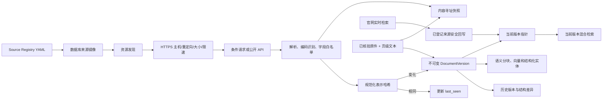

# Source Registry 与同步运行手册

| 属性 | 值 |
|---|---|
| 文档编号 | RUNBOOK-SOURCE-001 |
| 状态 | Current Operations Reference |
| 核验日期 | 2026-08-03 |

本文用于运行现有来源同步和排障，不授权自行扩大爬取范围或增加验收工程。新增来源
必须来自用户明确指示。

## 1. 目的

本手册说明如何登记、同步、检查和排障校园公开及校园级来源。Source Registry 是代码与
运行时共同执行的来源白名单，不是一个随意添加 URL 的爬虫入口。

配置文件：

```text
apps/api/src/hzcu_agent/resources/sources.yaml
```

应用启动和 CLI 会把配置镜像到 `source_definitions`，形成可审计的运行记录。
删除配置不会删除历史文档，只会停用对应数据库来源。

## 2. 数据流



## 3. 首批来源

| Source ID | 入口 | 策略 |
|---|---|---|
| `hzcu-main` | [学校主站](https://www.hzcu.edu.cn/) | 主站新闻列表与详情 |
| `hzcu-information-disclosure` | [信息公开目录](https://www.hzcu.edu.cn/index/xxgk/xxgkml.htm) | 目录、公开 HTML、可直接访问 PDF |
| `hzcu-innovation-training` | [创新训练系统](https://sjjx.hzcu.edu.cn/cxxl/index.aspx) | GB2312 列表与详情 |
| `hzcu-discipline-competitions` | [大学生学科竞赛网](https://sjjx.hzcu.edu.cn/xkjs/index.aspx) | GB2312 竞赛通知与成果 |
| `hzcu-admissions` | [本科招生网](https://zs.hzcu.edu.cn/) | 招生通知与指南 |
| `hzcu-campus-lectures` | [城院讲坛](https://cjgl.hzcu.edu.cn/lectureExternal) | 无登录公开 API、字段白名单 |
| `hzcu-learning-cms` | [学在城院](https://course.hzcu.edu.cn/hzcu) | 公开 CMS API、字段白名单 |
| `hzcu-undergraduate-education` | [本科教学公开信息](https://www.hzcu.edu.cn/rcpy/bksjy.htm) | 本科专业、教学建设、实践与特色培养 |
| `hzcu-academic-units` | [教学科研机构](https://www.hzcu.edu.cn/yxjg/jxkyjg.htm) | 学院和教学科研机构目录 |
| `hzcu-verified-official-materials` | 同源只读原件地址 | 已核验校方扫描材料；不可变原件 + 页级文本 |

### 3.1 P0 学院 / 部门通知源（2026-07-27）

发现明细见 `research/source-discovery/registry/`。连接器均为 `linked_html`，
**精确主机白名单**；校园 CMS 若仅提供 HTTP，可登记 `http://` 默认端口（禁止凭据、
禁止非 80/443 端口、禁止通配主机）。

| Source ID | 责任部门 | 列表形态 |
|---|---|---|
| `hzcu-jwb-notices` | 教务处 | jwb `tlist` → `detail` |
| `hzcu-gc-teacher-notices` | 工程学院 | 大汉 permissionunit col404 |
| `hzcu-gc-student-notices` | 工程学院 | 大汉 permissionunit col405 |
| `hzcu-tw-notices` | 校团委 | `redir.php?catalog_id` / `object_id` |
| `hzcu-jsxy-notices` | 计算机学院 | 大汉 permission col163/167 + 专业竞赛 col2613 |
| `hzcu-iee-notices` | 信电学院 | 学工 col6641 + 公示 col6978 |
| `hzcu-sxy-notices` | 商学院 | permission col7763 |
| `hzcu-media-notices` | 新闻与传播学院 | col5237 |
| `hzcu-tymy-notices` | 体育美育教学部 | permission col7011 |
| `hzcu-xgb-notices` | 学生工作部 | redir catalog |
| `hzcu-yjsc-notices` | 研究生处 | PHPCMS 通知、竞赛、学科与导师栏目 |
| `hzcu-dwzzb-notices` | 组织部、统战部 | redir catalog |
| `hzcu-hrd-notices` | 人才人事处 | redir catalog |

### 3.2 P1 学院 / 职能部门（续）

| Source ID | 责任部门 | 列表形态 |
|---|---|---|
| `hzcu-yxy-notices` | 医学院 | Newgen `list.htm` / `page.htm` |
| `hzcu-sfl-notices` | 外国语学院 | Newgen |
| `hzcu-rw-notices` | 人文学院 | 大汉 col |
| `hzcu-adc-notices` | 艺术与考古学院 | 大汉 col + permission |
| `hzcu-isct-notices` | 国际文化旅游学院 | permissionunit |
| `hzcu-gtkj-notices` | 国土空间规划学院 | 大汉 教师通知 |
| `hzcu-marx-notices` | 马克思主义学院 | PHPCMS lists/show |
| `hzcu-nzuwi-news` | 新西兰UW学院 | 大汉最新报道 |
| `hzcu-ccpo-notices` | 综合服务 | 会议/文件 col |
| `hzcu-xcb-notices` | 党委宣传部 | 大汉 |
| `hzcu-dzb-notices` | 党政办公室 | Newgen |
| `hzcu-aqbwb-notices` | 安全保卫部 | Newgen |
| `hzcu-jcb-notices` | 计划财务处 | Newgen |
| `hzcu-kyc-notices` | 科研处 | PHPCMS |
| `hzcu-sjc-notices` | 审计处 | PHPCMS |
| `hzcu-its-notices` | 信息与教育技术中心 | Newgen |
| `hzcu-hqjj-notices` | 总务处 | Newgen |
| `hzcu-gonghui-notices` | 工会 | redir catalog |
| `hzcu-cfd-notices` | 教师促进与发展中心 | 大汉 |
| `hzcu-jygs-notices` | 教育发展中心 | 大汉 + permission |
| `hzcu-lxzx-notices` | 留学中心 | Newgen |
| `hzcu-jjc-notices` | 基本建设处 | 大汉 |
| `hzcu-ipo-guides` | 国际交流与合作处 | permission 办事下载 |
| `hzcu-career-notices` | 就业网 | `/news/view/aid/` |

大汉权限栏目列表真源多为 `permissionunit.jsp`；公开 `art_*.html` 详情可能仅返回
JS `location.href` 跳转到 `permissionread/article.jsp`，连接器会跟同主机跳转。

一个聚合来源包含多个入口或 API 频道时，发现器会先读取每个入口，再按轮询方式
分配本轮资源额度。不得让第一个大栏目耗尽 `max_resources_per_run`，导致后面的
选课、考试、竞赛或导师栏目长期无法入库。

教务处 `hzcujwb` 等站在 WSL/Clash 下可能 502：请用 SSO 登录
`https://vpn.hzcu.edu.cn`（或 aTrust），再在 **VPN 可达、无 Clash 劫持** 环境下确认读取。
凭证不得写入本 yaml。详见 `sources.yaml` 文件头注释。

```bash
.venv/bin/hzcu-agent list-sources
.venv/bin/hzcu-agent sync-sources --source hzcu-gc-student-notices --limit 3
.venv/bin/hzcu-agent sync-sources --source hzcu-yxy-notices --limit 3
.venv/bin/hzcu-agent sync-sources --source hzcu-career-notices --limit 3
.venv/bin/hzcu-agent sync-sources --source hzcu-jwb-notices --limit 3
```

信息公开下载若要求人工验证码，连接器会拒绝发布，不规避验证。JSON API 的快照
只保存登记的允许字段。页面或 API 即使无需登录，也不得默认整包响应可以落库。

### 3.3 校外实时通知路由

Windows sidecar 的受控路由表位于：

```text
apps/vpn-sidecar/src/hzcu_vpn_sidecar/resources/vpn_notice_routes.yaml
```

当前有 37 条经过信源发现验证的 `*.vpn.hzcu.edu.cn:8118` 来源路由。路由表不是
第二套信源定义：每个 ID 必须
存在于主 Source Registry，返回 URL 必须规范化回官方主机并再次匹配详情规则。
未知 ID、非 HTTP aTrust 代理形态、凭据、查询串和片段会在启动时拒绝。

运行时的信任边界是来源 ID、精确官方主机、可见性和只读代理路由。详情正则用于
栏目归属、解析与排序，不再要求每个新文章路径先登记后才能查询；同主机动态内容页
会被发现，并在返回前按最具体的栏目模式重新归属。查询词面、实体类型、年级和
来源提示不得作为页面读取或证据进入 Agent 的硬门禁。

新增路由时必须同时：

1. 在 `research/source-discovery` 保存脱敏发现证据；
2. 确认它只映射已登记通知源；
3. 更新路由 YAML；
4. 运行 sidecar 策略测试；
5. 用 Headless Microsoft Edge 试读一次，只输出计数和来源 ID；
6. 在 `finally` 中关闭短时会话，不能保存 Cookie、Ticket 或正文。

### 3.4 全量镜像与时间边界

2026-07-27 的完整镜像批次以 47 个来源、123 个入口运行；后续加入工程学院全站和
核验材料后，当前 Registry 为 49 个来源、142 个网络入口。同步会遍历登记范围内的
栏目、分页、查询式详情、正文图片和附件。阶段清单对每个规范 URI 仅保留最新有效
状态；重跑时刷新列表，复用同日详情 HTML，只下载新增详情和附件。

当前镜像的最早发布日期为 2023-01-01。阶段清单中的
`excluded_before_cutoff`、数据库中的 `excluded_temporal`，以及已结束讲座的
`excluded_expired_event` 均不进入当前索引。

2026-07-27 批次报告见
[`FULL_CRAWL_COVERAGE_2026-07-26.md`](../research/source-discovery/registry/FULL_CRAWL_COVERAGE_2026-07-26.md)：
发现 9,763、可用 9,204、覆盖率 99.29%，当前可检索版本 9,221。

`operator_import` 没有网络入口，不参与 Worker 的网页发现。

### 3.5 已核验正式材料导入

当校方正式材料来自纸质扫描、线下文件或其他无法稳定抓取的渠道时，使用
`operator_import`，不要伪造一个网络发现 URL，也不要把任意用户上传自动提升为
官方来源。操作员必须先核实发布单位、原件完整性、发布日期/适用范围和材料的
共享权限。

处理步骤保持通用和原子化：

1. 用 PDF 渲染器把全部页面按顺序转成图像；
2. 用 `ocr_scanned_pages.py` 忠实转录页面，密集表格可拆成左右半页重跑；
3. 对数字、否定词、表头/行关系和无法辨认处进行人工核对；无法确认的内容保留
   `【无法辨认】`，不得猜测；
4. 用 `import_verified_document.py` 同时提交原件和页级 UTF-8 文本。

OCR 和导入脚本不判断材料属于评奖、课程、新闻还是通知。它们只生成可按页探索的
文本、保存原件和建立统一索引；选材料、翻页、理解表格与判断适用性仍由 Agent
完成。历史材料可以进入该来源，但必须记录真实日期、受众和“当前口径需另行
核验”的说明。

```bash
PYTHONPATH=apps/api/src:apps/api/scripts .venv/bin/python \
  apps/api/scripts/ocr_scanned_pages.py rendered-pages \
  --output output/pdf/document-verified-ocr.md

PYTHONPATH=apps/api/src .venv/bin/python \
  apps/api/scripts/import_verified_document.py original.pdf \
  output/pdf/document-verified-ocr.md \
  --source-id hzcu-verified-official-materials \
  --title "正式材料标题（扫描 OCR，历史口径）" \
  --publisher "发布单位" \
  --published-at 2021-09-01 \
  --audience "适用对象" \
  --note "当前口径需查询当年正式细则"
```

导入器按原件 SHA-256 和规范化内容去重，写入完成状态的 `SyncRun`，并把原件地址
设为当前 API 下的同源只读路由。学生端没有通用上传或导入接口。

## 4. 常用命令

先迁移：

```bash
make api-migrate
```

只读查看已登记来源：

```bash
.venv/bin/hzcu-agent list-sources
```

小批量试跑单个来源：

```bash
.venv/bin/hzcu-agent sync-sources \
  --source hzcu-innovation-training \
  --limit 3
```

同步全部来源：

```bash
.venv/bin/hzcu-agent sync-sources
```

检查当前版本召回：

```bash
.venv/bin/hzcu-agent search-memory \
  "创新训练项目答辩" \
  --top-k 8
```

新建迁移或升级抽取/向量版本后，重建所有不可变历史版本的索引：

```bash
.venv/bin/hzcu-agent reindex-memory
```

该命令重建 `DocumentChunk`、`CampusEntityRecord` 和可丢弃的
`campus_search_fts_v1`，不会修改原始快照和 `DocumentVersion`。chunks、entities
与既有本地向量继续保留，但当前 Agent 主检索只使用 FTS5。

运行周期 Worker：

```bash
.venv/bin/hzcu-agent sync-worker --poll-seconds 30
```

Docker Compose 会运行一次性 `migrate` 服务，再启动 API 和独立
`ingestion-worker`。不要在多个 Worker 实例之间横向扩容，直至实现数据库租约。

## 5. 只读状态 API

```text
GET /api/v1/sources
GET /api/v1/sources/alerts
GET /api/v1/sources/{source_id}/resources?limit=50&offset=0
GET /api/v1/sources/{source_id}/resources/{resource_id}/versions
GET /api/v1/sources/{source_id}/resources/{resource_id}/versions/{version_id}
GET /api/v1/sources/{source_id}/resources/{resource_id}/compare
GET /api/v1/sources/{source_id}/resources/{resource_id}/original
```

`/sources` 同时返回 `fresh_until`、健康状态、连续失败次数、分块和实体数量。
`/alerts` 返回过期和失败信号。版本比较接口默认比较上一版与当前版，也可以明确
传入 `from_version_id` 和 `to_version_id`。

资源 API 返回当前身份有权读取的规范化内容、结构字段和版本差异，不返回内部
快照路径、凭据或连接器配置。`original` 只为 `operator_import` 资源按来源
可见性流式返回已经核验的原件；它不是任意快照读取接口。匿名请求通常只看到
`public`，CA 会话可以看到 `public + campus`；试用环境可通过显式 Pilot 开关让
匿名设备读取 Campus 本地镜像。学生端没有触发同步的写接口，避免用户制造抓取
流量。

## 6. 新增来源检查表

1. 确认来源所有者、可见性、责任部门和允许用途。
2. 使用精确主机白名单（HTTPS 优先；校园 CMS 可 `http` 默认端口），不使用通配符，不保存凭据。
3. 确认列表、详情、分页、编码、附件和更新标识。
4. 设定最小必要频率、TTL、每分钟速率和响应大小。
5. 明确快照策略：`raw` 或 `sanitized`。
6. API 响应逐字段审查；无关个人字段必须白名单剔除。
7. 增加 Mock 测试：首轮创建、次轮不变、正文变化、外部重定向拒绝。
8. 用 `--limit 3` 做一次真实网络试跑。
9. 紧接着重复同步，确认没有动态浏览量等伪版本。
10. 检查语义分块、实体字段、当前版本混合召回、TTL 和原文链接。
11. 在版本工作台检查当前/历史分离和结构差异。
12. 人工制造一次可恢复失败，确认告警而不是“空结果”。

## 7. 故障处理

| 现象 | 处理 |
|---|---|
| `SOURCE_DISCOVERY_FAILED` | 检查入口 HTTP 状态、编码、DOM/API Schema |
| 大量 404 | 收紧发现正则，保留历史资源，不反复请求失效链接 |
| 返回验证码 | 不绕过；标记拒绝并寻找校方提供的公开直链/API |
| 正文乱码 | 检查响应 `charset`，增加编码回归样本 |
| 每轮都创建版本 | 对比规范化文本，剔除浏览量、随机 ID 等页面噪声 |
| PDF/图片无文本 | 执行 OCR；仍无文本时标记 `image_no_text_detected` 或 `low_text` |
| Worker 中断 | 当前运行记为 `interrupted`；重启后按来源间隔继续 |
| `degraded` | 最近一次失败但仍有旧成功版本；保留证据并实时复核 |
| `stale` | 已超过同步窗口；Agent 只把记忆当线索并调用实时工具复核 |
| `failing` | 连续失败且没有可用成功版本；不得解释为“暂无信息” |
| 索引版本升级 | 先迁移，再运行 `reindex-memory`，最后核对数量和检索 |
| `database is locked` | SQLite 有效并发必须为 1；确认 busy timeout 30000，不运行多个 Worker |
| `foreign_key_check` 非空 | 停止写入、备份数据库、运行最新 Alembic 修复迁移后复核 |

不要通过删除旧版本“修复”错误。错误版本应标记 `rejected`，当前指针切换到有效
版本或置空，以保留审计证据。

## 8. 安全边界

- 当前处理官方 `public` 与经校园身份授权的 `campus` 只读信息。
- 常规登录的学生密码只提交学校 CA；获批校外模式可由中心 API 瞬时转交 VPN
  sidecar，但应用、Source Registry、日志和模型均不得记录密码。
- 用户登录会话不作为后台同步 Worker 身份。
- 页面内容始终是不可信数据，不执行其中的指令和脚本。
- 重定向每一跳都重新检查来源精确主机。
- 查询时实时回写只接受已登记且当前身份有权访问的来源。
- 内部快照路径不通过学生端 API 暴露；只有已核验 `operator_import` 原件可经
  固定同源路由按来源可见性读取。
- 当前 CA/VPN 唯一能力是 `campus_notice.read`。申请、提交、撤回、报名、选退课、
  评价和预约等业务写操作在 Tool Gateway 与 sidecar 网络层同时禁止。
- 当前不读取个人数据、综合门户，也不提供校园业务写操作。

CA 登录与采集身份的完整边界见
[`ADR-0006`](adr/0006-optional-cas-membership-and-service-identity.md) 和
[`ADR-0007`](adr/0007-campus-notice-read-capability-and-vpn-sidecar.md)、
[`阶段 2 验收`](16-stage-2-acceptance-and-ca.md)。
