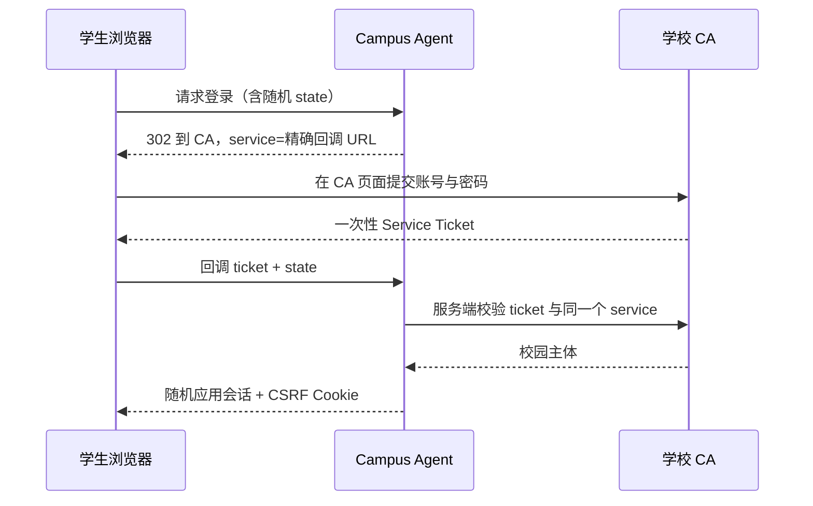
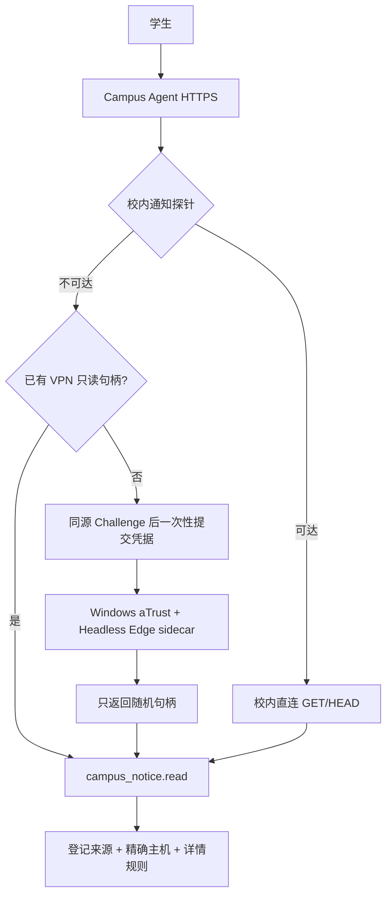

# 阶段 2 验收与 CA 接入

| 属性 | 值 |
|---|---|
| 文档编号 | ACCEPT-STAGE2-001 |
| 状态 | Accepted v1.1 |
| 核验日期 | 2026-07-27 |

## 1. 阶段目标

阶段 2 的完成标准不是“放入一些网页”，而是让 Agent 拥有可持续更新、可追溯、
有权限边界的校园感知层。它必须能够：

- 从登记的官方站点和 API 持续发现内容；
- 保留原文快照、不可变历史版本和当前版本指针；
- 在检索前执行 `public` / `campus` 可见性过滤；
- 对模糊问题由模型生成多种检索表达，而不是按业务标签硬路由；
- 在来源过期或失败时显式降级，不把抓取失败说成“学校没有通知”；
- 允许匿名提问，并可通过 CA 登录扩展到校园级信源。

## 2. 当前运行范围

Source Registry 当前登记：

| 指标 | 数量 |
|---|---:|
| 登记来源 | 47 |
| 登记入口 | 123 |
| 官方 aTrust + Headless Edge 来源 | 37 |
| 公开直连/官方 API 来源 | 10 |
| 发现资源 | 9,763 |
| 可用资源 | 9,204 |
| 当前可检索版本 | 9,221 |

`research/source-discovery` 中的 263 个候选栏目是发现清单，不等于 263 个运行时
信源。运行时将同一责任部门、同一主机和同一解析契约下的栏目聚合为一个来源，
并排除教师名录、重复新闻、个人系统、写操作入口和未通过安全验收的端点。

## 3. 新生问题覆盖

| 问题领域 | 已登记来源 | 当前结论 |
|---|---|---|
| 教学通知、选课、考试、学籍 | 教务处 9 个优先栏目、学在城院公开 CMS、本科教学 | 已接入 |
| 竞赛、创新训练 | 教务处竞赛栏目、学科竞赛网、创新训练网、学院竞赛栏目 | 已接入 |
| 专业与培养发展 | 本科专业/教学建设/实践教学/特色培养、学院与专业目录 | 已接入 |
| 导师选择 | 研究生处导师工作栏目、商学院等学院通知 | 部分接入；统一导师目录仍待正式源 |
| 社团与校园活动 | 校团委、学生工作部、城院讲坛、学院学工栏目 | 已接入通知；统一社团名录仍待正式源 |
| 学校政策、学生手册 | 信息公开目录、党政与职能部门来源 | 已接入目录；验证码附件不绕过 |
| 奖助、就业与发展 | 学生工作、学院学生通知、就业网、国际交流指南 | 已接入 |
| 校历 | 综合门户 `hzcu-ccpo-calendar`、校历正文图片 | 已登记、镜像并通过真实登录检索 |
| 图书馆使用 | 已发现图书馆入口，但当前返回访问控制页 | 候选，不进入运行时索引 |
| 个人课表、成绩、学分、选课操作 | 教务/门户能力已发现 | 阶段 2 明确排除 |

## 4. CA 登录模式

### 4.1 用户登录

常规 CA Redirect 模式下应用不获取学生密码。数据库只保存 HMAC 化主体、脱敏
尾号、权限范围和随机会话哈希。匿名会话只能查询 `public`；已登录会话可以查询
`public + campus`。

### 4.2 校内直连与校外 VPN

信息中心已确认允许接入真实 CA，并允许校外通知查询接收学生凭据。运行时按
**服务节点可达性**选择网络，而不是按用户 IP 猜测：

- 密码不落库、不进日志、不进快照、不进模型，只在 API→sidecar 登录调用期间存在。
- Cookie、CAS Ticket、VPN Token 留在 sidecar 的临时 Edge Context。
- 中心 API 只保存默认 15 分钟的进程内不透明句柄，退出与过期立即销毁。
- 普通业务请求只允许 `GET/HEAD/OPTIONS`；POST 仅限 CA 登录、aTrust 会话交换与
  资源目录控制路径；`PUT/PATCH/DELETE` 全部阻断。
- 工具只接受查询文本和数量，不接受 URL、HTTP 方法、Header、表单或目标学号。
- 验证码、动态口令和设备确认不绕过。

这不是“个人系统接入”。CA/VPN 唯一能力是 `campus_notice.read`；课表、成绩、
学分、待办、申请状态及所有代办仍明确排除。

### 4.3 采集服务身份

采集器与学生登录完全独立。生产接入顺序为：

1. 信息化部门确认部署网段、目标系统清单和只读字段；
2. 申请专用、最小权限、可吊销的服务账号或正式 API/OIDC 客户端；
3. 秘密由 Secret Manager 注入采集 Worker，不写 `.env.example` 和仓库；
4. 服务端按目标 `service` 获取短期会话，只访问精确端点白名单；
5. 响应先按字段白名单净化，再进入快照与索引；
6. 轮换、吊销、失败和越权均进入安全审计。

负责人测试账号仅用于发现与一次性可行性验证，不作为生产采集身份。目前已验证
普通 HTTP 客户端可以完成 CAS Ticket、IJW 会话和门户短期 Token 交换；真实
Headless Edge 也已完成 CA→aTrust→登记通知源查询闭环。生产仍需要填写正式
HTTPS Web/API 域名、精确回调 Service 和 sidecar HTTPS/mTLS 地址。若信息中心
批准在受控网段使用现有 HTTP CA，必须显式设置
`HZCU_CAS_HTTP_TRANSPORT_APPROVED=true`，不能静默降低校验。

## 5. 阶段 2 实施清单

| 工作项 | 状态 | 验收 |
|---|---|---|
| Source Registry 与精确主机白名单 | 完成 | 配置加载、镜像和 URL 安全测试 |
| 多入口/多频道公平发现 | 完成 | 后续栏目不会被首个栏目挤占 |
| 栏目/分页/查询式详情/图片/附件穷举 | 完成 | 分类与 pattern 只作软信号 |
| 2023 年边界与过期活动排除 | 完成 | 当前索引泄漏数均为 0 |
| 图片、PDF OCR 与二进制回退 | 完成 | 待处理 OCR 为 0 |
| 可续跑阶段镜像与详情复用 | 完成 | 最新状态导入、默认 4 路附件并发 |
| 版本、快照、哈希、当前指针 | 完成 | 同 URI 变更产生不可变新版本 |
| 分块、向量、结构化实体 | 完成 | 仅检索当前版本，历史可重建 |
| 来源观测、告警、版本比较 | 完成 | Web 与只读 API 可见 |
| `public` / `campus` 召回隔离 | 完成 | 匿名与登录测试 |
| 可选真实 CAS 登录和应用会话 | 完成代码 | 生产待填精确 Service、域名和证书 |
| 登录前端和退出隔离 | 完成 | 权限变化创建新对话 |
| 校内直连 / 校外 VPN 自动路由 | 完成 | 真实 Windows aTrust + Headless Edge 验收通过 |
| 凭据 Challenge、同源与短时句柄 | 完成 | Mock 端到端与策略测试通过 |
| `campus_notice.read` 强制边界 | 完成 | 非认证 POST、PUT/PATCH/DELETE 和任意 URL 被拒绝 |
| aTrust 通知路由注册表 | 完成 | 37 条来源路由完成全量镜像 |
| 学科竞赛与学院竞赛补源 | 完成登记 | 可达来源已完成实际同步 |
| SQLite 并发写锁与外键修复 | 完成 | 串行写、busy timeout、FK ON、违规 0 |
| 全量真实同步与最终数量 | 完成 | 无数据库锁；受限网络失败按故障语义记录 |
| 校历 | 完成登记 | 综合门户 `col10382` 已通过真实登录实时验收 |
| 统一导师/社团目录、图书馆 | 后续补源 | 不阻塞已登记来源的阶段 2 闭环 |

### 5.1 真实验收记录

- 真实校外链路成功创建 `campus_notice.read` 会话。
- Headless Microsoft Edge 通过本机 aTrust 打开登记的 VPN 通知代理。
- 查询返回 3 条 `hzcu-ccpo-notices` 证据，并再次通过来源 ID、规范 URL、精确
  主机和详情规则校验。
- 验收输出只包含会话布尔值、证据数量和来源 ID，不输出正文、账号、密码、
  Cookie、Ticket 或 Token。
- API 与 sidecar 均关闭包含原始查询串的 Uvicorn access log；销毁句柄只置于
  受保护请求体，不放进 URL。
- `finally` 路径已销毁 Edge Context 与短时句柄。
- SQLite 当前为迁移 `0005_repair_identity_foreign_keys`，完整性检查为 `ok`，
  外键违规为 0，修复前数据库已有独立备份。
- 完整抓取发现 9,763 个资源、可用 9,204 个、真实失败/死链 66 个，排除非内容
  32 个、排除 2022 年及以前资源 461 个，覆盖率 99.29%。
- 数据库 9,684 个资源、9,654 个当前版本、9,221 个当前可检索版本；
  417 个旧资源和 14 个过期讲座处于排除状态，待处理 OCR 为 0。

## 6. 不进入阶段 2 的能力

- 个人成绩、学分、课表、选课状态和待办；
- 代表学生申请、提交、撤回、报名、选退课、评价、预约或修改数据；
- 共享负责人账号让所有用户访问个人系统；
- 绕过验证码、访问控制或学校网络边界；
- 把 263 个发现候选不经筛选地全部放入模型。

## 7. 生产启用的部署前置项

接入授权已经确认；部署时仍需把以下具体值交付给运维：

- Campus Agent 正式 HTTPS 域名；
- 精确 CAS 回调 URL 的 Service 登记；
- 浏览器可用的 HTTPS CA 地址，或现有 HTTP CA 的受控网段书面批准；
- Windows aTrust sidecar 主机、容量、HTTPS/mTLS 证书和独立 API Token；
- 生产采集专用服务账号/API 客户端，而非个人负责人账号；
- 允许访问的系统、字段、频率、保留期和审计责任人。

这些值未配置时，生产部署保持 `HZCU_AUTH_MODE=anonymous` 和
`HZCU_CAMPUS_QUERY_ROUTE=disabled`。代码不会通过硬编码负责人凭据、复制 Cookie
或开放通用代理来伪造“已接入”。

## 8. 验收结论

阶段 2 的功能实现、数据库修复、来源登记、完整结构镜像、真实 CA/aTrust 可行性
和当前语料边界均已通过。正式部署参数仍是上线前置项，但不再属于本阶段的编码
缺口。该阶段已经关闭；项目当前处于阶段 5，后续数据变更仍须持续满足本验收基线。
